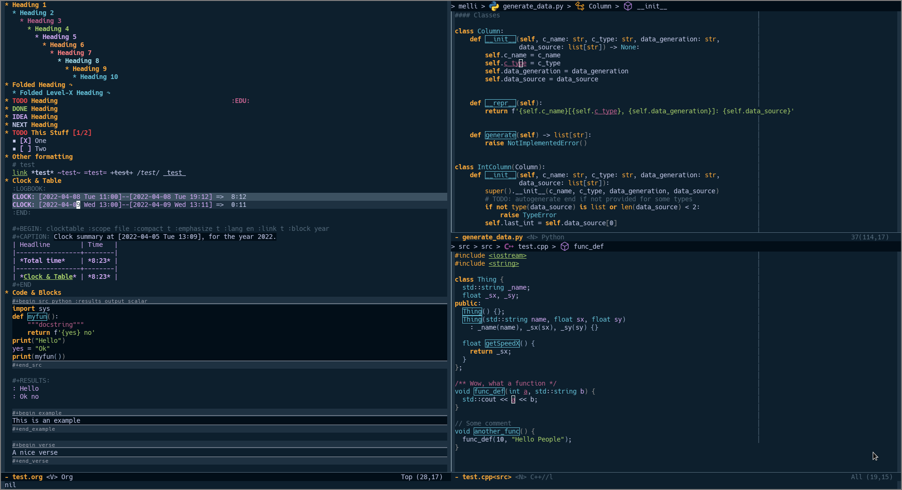
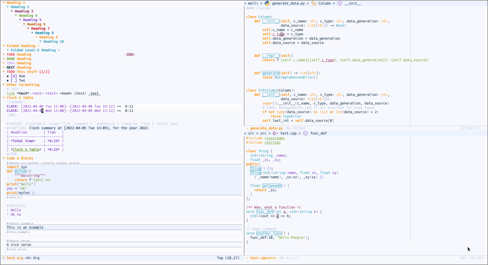

[](https://melpa.org/#/shanty-themes)

# Shanty Emacs Theme

The shanty emacs theme is meant for us, you and me - the workers - who may
not get dirty hands very often but love to code and tinker while looking at
a screen full of pleasant colors.

This theme is fairly new and still under more or less active development.
Feel free to contact me about possible enhancements (:

This theme provides a dark and also a light variant.

## Installation

The theme is now available through `package.el` (MELPA).

```emacs-lisp
;; Add this to your init.el to make packages from MELPA available through package.el
(require 'package)
(add-to-list 'package-archives '("melpa" . "https://melpa.org/packages/") t)
(package-initialize)

;; Install the theme
(package-install 'shanty-themes)
```

Or interactively via `M-x` `package-install` and then type `shanty-themes`.

If the package didn't show up try `M-x` `package-refresh-contents`.

Alternatively, one could either use straight to install the package:

```emacs-lisp
(straight-use-package '(shanty-themes :host github :repo "qhga/shanty-themes")) ;; GITHUB
(straight-use-package 'shanty-themes) ;; MELPA
```

Or by manually adding `shanty-themes.el`, `shanty-themes-dark-theme.el` and
`shanty-themes-light-theme.el` to `~/.emacs.d/themes` and the following to your `init.el`:

```emacs-lisp
(add-to-list 'custom-theme-load-path "~/.emacs.d/themes")
```

To activate the theme, one could use `M-x` `load-theme` and activate either the
dark version `shanty-themes-dark` or the light verison `shanty-themes-light`

To load the theme automatically on startup add the following code to your init.el
```emacs-lisp
;; For the dark version
(load-theme 'shanty-themes-dark t)

;; For the light version
(load-theme 'shanty-themes-light t)
```

## Screenshots

### Shanty Themes Dark




### Shanty Themes Light




## Configuration

For now, there are not many configuration options available. If you have any suggestions,
feel free to open an issue.

```emacs-lisp
(setq shanty-themes-function-box t) ;; Enable or disable the boxes around function definitions
```

## Officially Supported Modes

The faces of the following modes have all been **manually** adjusted to fit the themes aesthetics.
This does not mean, that other modes have to look ugly or weird, because a lot of modes inherit
face attributes from more general definitions (e.g. comment-like-faces often inherit from `shadow`).

- [x] Ansi-colors (Light Versions have to be set by the user to highlight *shell* buffers)
- [x] Avy
- [x] Ccls
- [x] Company-mode
- [x] Compilation
- [x] Custom
- [x] Diff
- [x] Dired
- [x] Ediff
- [x] Ein (emacs ipython notebook)
- [x] Evil-mode
- [x] Flycheck
- [x] General Programming
- [x] Git-gutter / git-gutter-fringe
- [x] Gnus
- [x] Helm
- [x] Info
- [x] Ivy
- [x] Linum
- [x] Lsp-mode / lsp-ui
- [x] Magit
- [x] Marginalia-mode
- [x] Markdown-mode
- [x] Message-mode
- [x] Minibuffer
- [x] Mode-line
- [x] Org-agenda
- [x] Org-mode
- [x] Outline
- [x] Rainbow-delimiters
- [x] Speedbar
- [x] Straight
- [x] Swiper
- [x] Symbol-overlay
- [x] Term-color
- [x] Tty-menu
- [x] Undo-tree
- [x] Vertico-mode
- [x] Xref